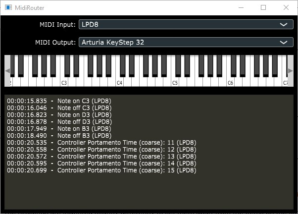

# MidiRouter

Route and monitor MIDI messages from one device to another

## Download

* [MidiRouter Windows Executable](bin/win64/MidiRouter.exe)

## Dependencies: 

* [JUCE 5.4.6](https://juce.com) 
* JUCE dependencies on Linux (apt install)
** `sudo apt-get install -y g++ libgtk-3-dev libfreetype6-dev libx11-dev libxinerama-dev libxrandr-dev libxcursor-dev mesa-common-dev libasound2-dev freeglut3-dev libxcomposite-dev libcurl4-openssl-dev`
** `sudo add-apt-repository -y ppa:webkit-team/ppa && sudo apt-get install libwebkit2gtk-4.0-37 libwebkit2gtk-4.0-dev`